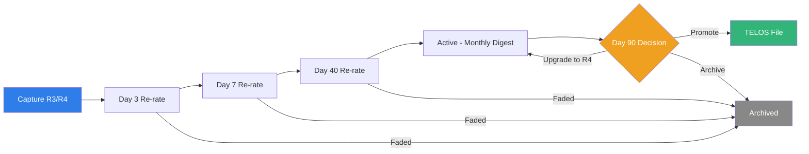
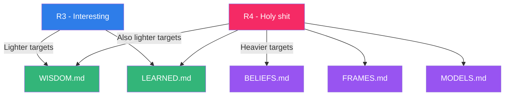
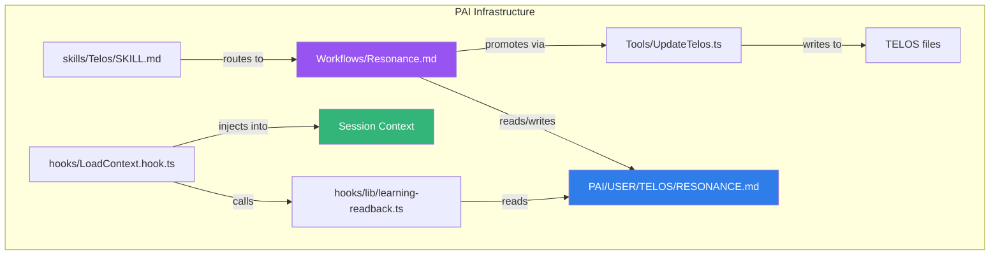

# PAI Resonance Workflow

**A time-decay insight tracking system for [PAI](https://github.com/danielmiessler/Personal_AI_Infrastructure) (Personal AI Infrastructure).**

Capture ideas and insights that strike hard, then subject them to scheduled re-rating to separate genuine signal from novelty. Only what truly endures gets promoted into your core life philosophy (TELOS).

## The Concept

Most "save for later" systems become graveyards. Resonance is different — it has a **decay lifecycle**. You capture at the moment of impact (R3 or R4 only — low resonance is noise), then the system forces you to re-evaluate at increasing intervals. What survives the filter earns its place in TELOS. What fades gets archived — and what fades reveals what endures.

### Rating Scale

| Rating | Meaning | Promotion Targets |
|--------|---------|-------------------|
| **R3** | "Interesting..." | WISDOM.md, LEARNED.md |
| **R4** | "Holy shit." | BELIEFS.md, FRAMES.md, MODELS.md (+ all R3 targets) |

R1/R2 don't exist. If it's not at least R3, it's noise.

## Lifecycle



At each checkpoint, you re-rate: "Still hits? Upgraded? Dropped? Faded?" Items that fade get archived (never deleted). Items that survive all checkpoints face a **forced decision at Day 90** — no indefinite limbo.

### Monthly Digest

On the 1st of each month, the session-start hook surfaces a compact summary of all Active items. Visibility, not a forced action.

### Day 90 Purge

Per item, relative to capture date. If still in Active at 90 days: forced decision — promote, upgrade to R4, or archive.

## Promotion Ladder



The depth of the target matches the depth of the resonance.

## Item Format

Each active item in `RESONANCE.md`:

```markdown
### RES-1: [Insight, concise]
- **Rating:** R4
- **Source:** [Person, book, article, own thinking]
- **Captured:** 2026-03-12
- **When:** [Optional — situational anchor, not a rationalization]
- **Day 3:** [pending 2026-03-15]
- **Day 7:** [pending 2026-03-19]
- **Day 40:** [pending 2026-04-21]
- **Day 90:** [pending 2026-06-10]
- **Target:** WISDOM.md > Borrowed Wisdom
```

No "why" field. Resonance is a signal from the unconscious — forcing a rationalization at capture defeats the purpose. The optional `When` field is just a situational anchor to help recall the moment.

## Operations

| Operation | Trigger | What Happens |
|-----------|---------|--------------|
| **Capture** | "R3", "R4", "resonance", "that resonated" | Extract insight, ask rating + source, auto-compute dates, write to Active |
| **Review** | "review resonance", or surfaced at session start | Show due items, re-rate each via structured question |
| **Promote** | "promote RES-N", or during Day 90 review | Move to target TELOS file, archive in RESONANCE.md |

## Scope: RESONANCE.md vs BOOKS.md / MOVIES.md

These don't collide — different granularity:
- **BOOKS.md** = the book as a whole ("I love this book")
- **RESONANCE.md** = a specific moment of recognition from *anywhere*

A book can be in BOOKS.md and a quote from it independently in RESONANCE.md. The `Source` field handles the link.

## Architecture



## Installation

### Automated (recommended)

```bash
git clone https://github.com/catchingknives/pai-resonance-workflow.git ~/git/pai-resonance-workflow
cd ~/git/pai-resonance-workflow
chmod +x install.sh
./install.sh
```

The install script is **idempotent** — safe to run multiple times. It checks for existing installations before patching.

### For AI Agents

If you're a PAI instance reading this repo to install the Resonance workflow:

1. Read `INSTALL.md` for the complete integration guide
2. Copy `src/RESONANCE.md` to `~/.claude/PAI/USER/TELOS/RESONANCE.md`
3. Copy `src/Resonance.workflow.md` to `~/.claude/skills/Telos/Workflows/Resonance.md`
4. Apply the 4 patches described in `INSTALL.md` to existing PAI files
5. Verify by running `loadResonanceDue()` — should return null for empty file

### Manual

See `INSTALL.md` for step-by-step instructions with exact code snippets.

## Design Decisions

- **Single file** — expected volume is ~2-5/week at R3+ filter. Split later if needed.
- **No automatic demotion** — overdue items stay active with a flag. User makes all drop decisions.
- **Session-start surfacing** — primary reminder via LoadContext hook. No external notification dependency.
- **Target field optional at capture** — fill it when the item's nature is clearer.
- **Archive, don't delete** — what fades reveals what endures.

## License

Personal use. Part of the [PAI ecosystem](https://github.com/danielmiessler/Personal_AI_Infrastructure).
